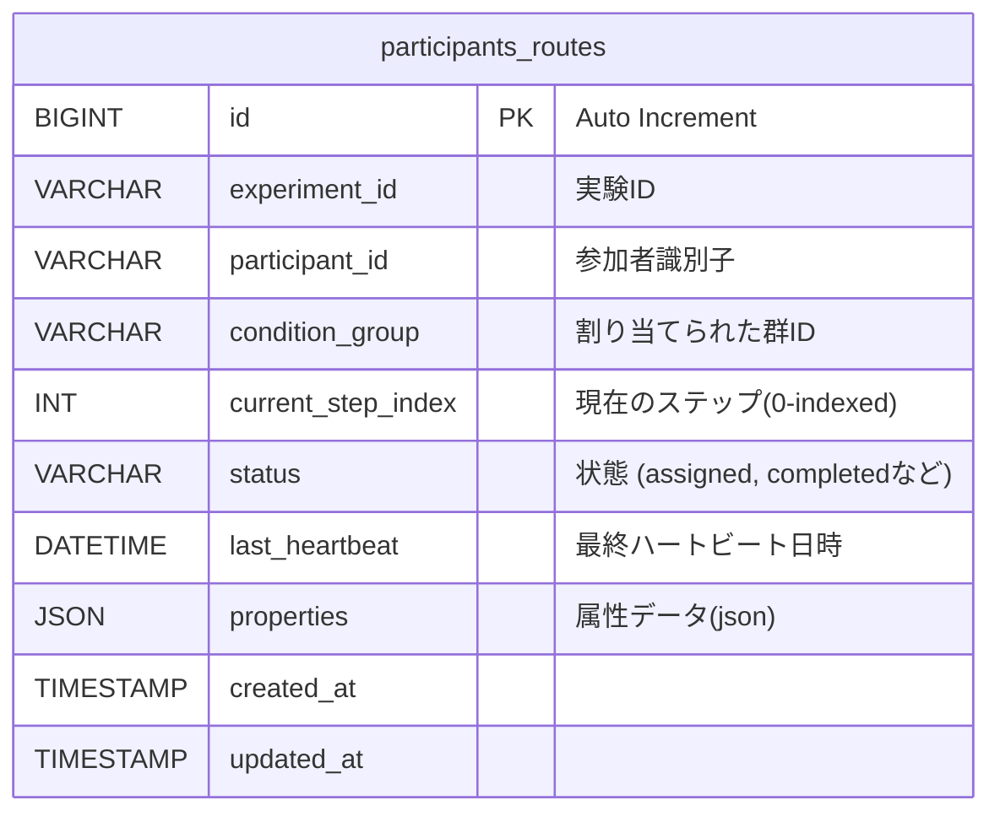

# 開発者向けガイド (Contributing Guide)

## ディレクトリ構成

プロジェクトの主要なディレクトリとファイルの役割は以下の通りです。

```
/
├── app/
│   ├── dependencies.php   # DIコンテナ定義 (DB初期化ロジック等)
│   ├── middleware.php     # ミドルウェア登録
│   ├── routes.php         # アプリケーションルーティング定義
│   └── settings.php       # 設定読み込みロジック
├── public/                # 公開ディレクトリ (Webサーバーのドキュメントルート)
│   └── index.php          # フロントコントローラー
├── src/
│   ├── Application/       # アプリケーション層
│   │   ├── Actions/       # コントローラーロジック (AssignAction, NextAction等)
│   │   └── Middleware/    # カスタムミドルウェア
│   └── Domain/            # ドメイン層
│       ├── Participant/   # 参加者モデル (Participant.php)
│       └── Router/        # ルーティングロジック (RouterService.php)
├── config.jsonc           # 設定ファイル (ユーザー定義)
└── config.schema.json     # 設定ファイルのJSONスキーマ
```

## データベース設計

本システムは、以下の単一テーブル構成で動作します。テーブル名は `config.jsonc` で変更可能です（デフォルト: `participants_routes`）。

### ER図 (Mermaid)



### カラム詳細

| カラム名 | 型 | 説明 |
| :--- | :--- | :--- |
| `id` | BIGINT | プライマリキー |
| `experiment_id` | VARCHAR | 実験ID (`config.jsonc`のキーと対応) |
| `participant_id` | VARCHAR | 参加者を一意に識別するID (ユニーク制約の一部) |
| `condition_group` | VARCHAR | 割り当てられた実験条件グループ名 |
| `current_step_index` | INT | 現在の進行ステップ番号 (0始まり) |
| `status` | VARCHAR | 参加状態 (`assigned`, `completed`) |
| `last_heartbeat` | DATETIME | 最終アクセス/ハートビート日時 (離脱判定に使用) |
| `properties` | JSON | 参加者属性データ (スクリーニングや分岐に使用したデータ) |

> [!NOTE]
> `experiment_id` と `participant_id` の複合ユニーク制約により、同一実験への同一IDでの重複登録を防いでいます。

## 開発フロー

1. **環境構築**: `composer install` で依存関係をインストールします。
2. **テスト**: `tests/` ディレクトリにPHPUnitテストが含まれています。
   ```bash
   vendor/bin/phpunit
   ```
3. **ローカル実行**: PHPビルトインサーバーでの動作確認が可能です。
   ```bash
   php -S localhost:8080 -t public
   ```
